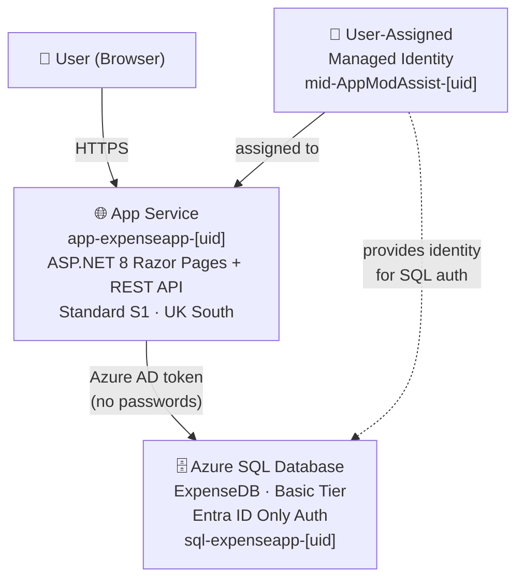

# Architecture Diagram – Expense Management System

## Overview

This diagram shows the Azure resources deployed by the deployment scripts and how they interact.

```
┌─────────────────────────────────────────────────────────────────┐
│                        Azure (UK South)                         │
│                                                                 │
│   ┌─────────────────────────────┐                               │
│   │   Resource Group            │                               │
│   │   rg-expenseapp-dev         │                               │
│   │                             │                               │
│   │  ┌──────────────────────┐   │                               │
│   │  │  User-Assigned       │   │                               │
│   │  │  Managed Identity    │   │                               │
│   │  │                      │   │                               │
│   │  │  mid-AppModAssist-   │   │                               │
│   │  │  [uniqueString]      │   │                               │
│   │  └──────────┬───────────┘   │                               │
│   │             │ assigned to   │                               │
│   │             ▼               │                               │
│   │  ┌──────────────────────┐   │     HTTPS                     │
│   │  │  App Service         │◄──┼─────────────  👤 User         │
│   │  │  (Standard S1)       │   │                               │
│   │  │                      │   │                               │
│   │  │  app-expenseapp-     │   │                               │
│   │  │  [uniqueString]      │   │                               │
│   │  │                      │   │                               │
│   │  │  ASP.NET 8 Razor     │   │                               │
│   │  │  Pages + REST API    │   │                               │
│   │  └──────────┬───────────┘   │                               │
│   │             │               │                               │
│   │             │ Azure AD      │                               │
│   │             │ Managed       │                               │
│   │             │ Identity      │                               │
│   │             │ Auth          │                               │
│   │             ▼               │                               │
│   │  ┌──────────────────────┐   │                               │
│   │  │  Azure SQL Database  │   │                               │
│   │  │  (Basic tier)        │   │                               │
│   │  │                      │   │                               │
│   │  │  sql-expenseapp-     │   │                               │
│   │  │  [uniqueString]      │   │                               │
│   │  │                      │   │                               │
│   │  │  Database: ExpenseDB │   │                               │
│   │  │  Entra ID auth only  │   │                               │
│   │  │  No SQL passwords    │   │                               │
│   │  └──────────────────────┘   │                               │
│   └─────────────────────────────┘                               │
└─────────────────────────────────────────────────────────────────┘
```

## Mermaid Diagram



## Authentication Flow

1. **User → App Service**: Standard HTTPS request. No authentication required at the App Service level (auth can be added via Easy Auth if needed).

2. **App Service → Azure SQL**: The App Service uses the **User-Assigned Managed Identity** to obtain an Azure AD token for the SQL endpoint (`https://database.windows.net/.default`). The token is passed automatically via the connection string:
   ```
   Authentication=Active Directory Managed Identity;User Id=<client-id>;
   ```

3. **No passwords stored**: SQL authentication is disabled on the server. All access is via Entra ID tokens. The managed identity is granted `db_datareader`, `db_datawriter`, and `EXECUTE` permissions inside `ExpenseDB`.

## Resources Created

| Resource | Type | SKU | Region |
|---|---|---|---|
| `rg-expenseapp-dev` | Resource Group | – | UK South |
| `mid-AppModAssist-[uid]` | Managed Identity | – | UK South |
| `asp-expenseapp-[uid]` | App Service Plan | Standard S1 | UK South |
| `app-expenseapp-[uid]` | App Service (Web App) | – | UK South |
| `sql-expenseapp-[uid]` | SQL Server | – | UK South |
| `ExpenseDB` | SQL Database | Basic | UK South |

## Local Development

For local development (without a managed identity), update `appsettings.Development.json` to use:
```json
"Authentication=Active Directory Default;"
```
Then run `az login` before starting the application. The Azure CLI credential is used automatically.
